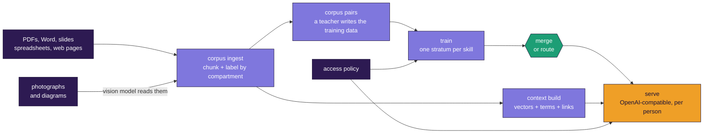

<div align="center">


# STRATUM

### Turn your company's documents into a language model that only tells each person what they are allowed to know

**S**pecialized **T**raining via **R**eusable **A**dapter **T**iles and **U**nified **M**erging

*Train small skill layers one at a time on a laptop, fuse or route between them, and serve the result behind your own address. No data-center GPUs. No ML background. Every concept explained from zero.*

[](LICENSE)
[](pyproject.toml)
[](docs/16-what-changed.md)

</div>

---

## Point it at a folder. Get a model.

```bash
stratum corpus ingest --in company-docs/ --out chunks/ --compartments
stratum corpus pairs  --chunks chunks/chunks.jsonl --teacher claude-cli --out data/skill.jsonl --test-out data/skill-test.jsonl --instruction "Write questions a field engineer would ask."
stratum train --skill data/skill.jsonl --out strata/engineering
stratum serve strata/* --context index/ --policy policy.json
```

PDFs, Word files, spreadsheets, slide decks, web pages and **photographs of equipment** go in one end. A tested, servable model comes out the other, on a laptop, in an afternoon.

---

## What makes it different

<table>
<tr><td width="33%" valign="top">

### Skills are separate things

Each skill is a **stratum** of a few megabytes, trained on its own. Fuse them into one model, or keep them apart and route per request. Adding a skill never means retraining what you already had.

</td><td width="33%" valign="top">

### Access control that actually holds

**You cannot filter a weight.** So who may see what is decided *before* training. Compartments that only some people can read never enter shared parameters, and a canary audit tries to break it on every build.

</td><td width="33%" valign="top">

### It tells you when it will not work

Merging three skills produced empty output, and that is in the docs. Routing failed on overlapping skills, and that is in the docs with the numbers. Measurements beat opinions here, including when they are unflattering.

</td></tr>
</table>

---

## The whole thing, in one picture



---

## Real numbers, measured on a laptop

An RTX 4070 with 8.6 GB of VRAM, on a 1,115-chunk corpus of energy engineering documents plus real equipment photographs.

| | |
|---|---|
| Corpus ingested, including 5 images read by a local vision model | **14 seconds** cached, 2 minutes cold |
| Context index over 1,115 chunks, 24,886 terms, 13,356 links | **4.5 MB**, builds in seconds |
| Retrieval latency against 4 to 6 seconds of generation | **10 to 15 ms**, about 0.3% of a request |
| One stratum, 300 training pairs, 3 epochs | **2 minutes** |
| Two teachers compared head to head on identical chunks | Qwen3-8B won 2 of 3 skills against Claude |

Two findings worth having, both of which went against what was expected:

- **Giving a fine-tuned model the exactly correct chunk sometimes makes it worse.** Measured across three skills: safety improved by 5.5 points, extract was flat, explain got slightly worse. `stratum eval --context-style oracle` measures this on your own corpus in an afternoon.
- **Read *order* on an NVMe drive is worth 2%. Read *size* is worth 2.2x.** Every read costs about 205 microseconds no matter how small, so what to minimise is the number of reads that happen one after another. The tool that measured it ships in [`engine/`](engine/README.md).

---

## Company data, without the model telling everyone everything

This is the part most tools do not have, and the reason is that it cannot be bolted on afterwards.

A row in a database has an owner and a query can be filtered. A number inside a matrix of weights has neither. Once a salary figure is in the parameters, no check downstream keeps it from a contractor, because the model does not look it up, it just knows it.

So STRATUM decides at build time, by asking two questions about every set of documents: **how many people can see it**, and **how often does it change**.

| Tier | When | Where the knowledge goes |
|---|---|---|
| **company** | everyone sees it, changes rarely | into weights, one shared adapter |
| **department** | a department shares it, changes rarely | into weights, that department's adapter |
| **restricted** | narrow, sensitive, or volatile | **index only, never the weights** |

```bash
stratum access init  --out policy.json                 # who sees what
stratum access check policy.json --chunks chunks/...   # does it match the corpus
stratum access plant policy.json --data-dir data/      # canaries, BEFORE training
# ... train one stratum per compartment ...
stratum context build --chunks chunks/... --out index/
stratum access audit policy.json --index index/ --strata-dir strata/
```

A **canary** is a fact that exists in exactly one compartment and could not be guessed, invented or reasoned out. `plant` puts one into each compartment's training data before training, and `audit` then asks every person for every canary they should not be able to reach.

The order matters. Auditing a build that was never planted reports **INCONCLUSIVE** rather than a pass, because a model that never learned a secret cannot leak it, and reporting that as clean would be the most dangerous kind of green tick.

Retrieval, link expansion and the model weights are attacked separately, because they fail differently. A surface that was not tested is reported as **not tested**, never as passed.

Right to erasure falls out of the same rule. Deletion requests are nearly always about restricted material, and restricted material was never in the weights, so it is a row deletion rather than a retrain.

[Chapter 17](docs/17-access-control-and-context.md) explains all of it from zero.

---

## Quick start

```bash
git clone https://github.com/sarkar4777/stratum.git && cd stratum
pip install -e .

stratum setup     # installs what THIS machine is missing
stratum doctor    # and tells you what it found
```

`stratum setup` knows a Mac from an NVIDIA box. On Apple silicon it knows the ordinary PyTorch wheel already uses the GPU and there is no CUDA-style download to hunt for, and that 4-bit compression will never work there at any version. On an NVIDIA machine it knows that `pip install --upgrade torch` silently leaves the CPU build in place, which is the single most common way this project fails for people.

```bash
# understand it first, no GPU, about 20 seconds
python scripts/demo_concepts.py

# train two skills, fuse them, measure, use
stratum train --skill examples/extract.jsonl  --out strata/extract  --base Qwen/Qwen3-1.7B
stratum train --skill examples/classify.jsonl --out strata/classify --base Qwen/Qwen3-1.7B
stratum merge strata/extract strata/classify --out models/my-slm
stratum eval  models/my-slm --test examples/test-extract.jsonl --scorer json_field
stratum chat  models/my-slm

# or keep them apart and route between them
stratum route train strata/extract strata/classify --out router.json
stratum serve strata/* --router router.json --port 8927
```

Or run the whole build from one recipe, with its own pass or fail gates, so a finished build is a tested build:

```bash
stratum plan  examples/recipe.yaml   # will it fit here? if not, what will, and where to rent it
stratum stack examples/recipe.yaml   # train everything, fuse, run the gates
```

---

## Build here, serve there

The machine that builds a model and the machines that serve it are rarely the same. Building wants a GPU for an hour. Serving wants to be near the people asking, on several machines, for months.

```bash
# on the GPU box
stratum pack strata/* --out bundle/ --index index/ --policy policy.json --router router.json

# on each serving node
stratum unpack bundle/ --run --host 0.0.0.0
```

The bundle carries a manifest with a sha256 for every file, and `unpack` verifies all of them before anything is served. A half-copied adapter does not announce itself, it just answers slightly worse, and that is exactly the failure this catches.

The base model is deliberately **not** in the bundle. It is gigabytes, it is identical everywhere, and every node can pull it from one place. The manifest records which one is required so a mismatch is caught rather than discovered.

---

## Different models for different data

A model good at reading a P&ID diagram is not the model you want writing training questions about a maintenance contract. So pick per data type:

```bash
stratum corpus ingest --in docs/ --out chunks/ --images hf          # local vision model
stratum corpus pairs  --chunks chunks/chunks.jsonl \
  --teacher claude-cli --image-teacher hf --image-teacher-model Qwen/Qwen2.5-VL-3B-Instruct
```

Train a separate skill per data type with `--kind image` or `--kind document`, and the router picks between them at serve time. A question mentioning a diagram, a nameplate or an axis leans toward the skill that learned from pictures.

`stratum teachers` measures your machine and tells you which models it can actually run, and how fast, before you download 60 GB to find out.

---

## Documentation, written as a short book

Read in order, or jump to what you need. Zero prior knowledge assumed anywhere.

| # | Doc | You will understand |
|---|-----|-------------------|
| 0 | [What is a language model?](docs/00-what-is-a-language-model.md) | Tokens, parameters, training, from zero |
| 1 | [The memory problem](docs/01-the-memory-problem.md) | Why laptops struggle, with real numbers |
| 2 | [The STRATUM idea](docs/02-the-stratum-idea.md) | Why build in independent layers |
| 3 | [LoRA and adapters](docs/03-lora-and-adapters.md) | Training 1% of a model, and rank |
| 4 | [Muon, explained fully](docs/04-muon-explained.md) | Why Muon beats AdamW here |
| 5 | [Merging strata](docs/05-merging.md) | The fuse math, three methods, honest limits |
| 6 | [Training internals](docs/06-training.md) | The loss mask and every default |
| 7 | [Distillation](docs/07-distillation.md) | Teaching a small model from a big one |
| 8 | [Evaluation](docs/08-evaluation.md) | Proving it works rather than guessing |
| 9 | [Full walkthrough](docs/09-full-walkthrough.md) | Empty folder to working model |
| 10 | [Scaling and production](docs/10-scaling-and-production.md) | Bigger models, serving, industry patterns |
| 11 | [Glossary](docs/11-glossary.md) | Every term, full form, plain definition |
| 12 | [For experienced developers](docs/12-for-experienced-developers.md) | Every concept mapped to patterns you know |
| 13 | [Troubleshooting](docs/13-troubleshooting.md) | The problems people actually hit, with fixes |
| 14 | [From a corpus to a model](docs/14-from-corpus-to-model.md) | Thousands of documents and images in, tested model out |
| 15 | [Routing and serving](docs/15-routing-and-serving.md) | Picking a skill per request instead of merging |
| 16 | [What changed, and why](docs/16-what-changed.md) | Every command explained from zero, and what `engine/` is |
| 17 | [Access control and context](docs/17-access-control-and-context.md) | Company data in a model, safely |
| 18 | [Deploying at scale](docs/18-deploying-at-scale.md) | Laptop to a network of GPU machines |

**Coming back to a version you have not used?** Start at [16](docs/16-what-changed.md). It stands alone and assumes nothing.

A complete worked example lives in [`examples/energy/`](examples/energy/): a public web corpus turned into a tested energy-sector model, with every command, the measured gains over the base model, and the two failures the build hit on the way.

---

## Who it is for

- You have a laptop with a consumer GPU, 8 GB of VRAM is plenty, or a patient CPU.
- You want a model good at **your** tasks, extraction, classification, domain questions, not a general chatbot.
- Your documents cannot leave your environment.
- Different people in your organisation are allowed to see different things.
- You want to understand why it works, not copy commands.

**Coming from Java, C++, C# or backend Python?** [Doc 12](docs/12-for-experienced-developers.md) maps every concept here to patterns you already know. Adapters as plugins, merging as patch composition, distillation as caching a senior engineer's judgement.

## What STRATUM is not

- **Not a general-knowledge model.** It is good at the specific things you train it on. That is the point.
- **Not instant.** One stratum is minutes to a couple of hours on a laptop. Start it before lunch.
- **Not magic merging.** Strata from different bases, or deeply conflicting skills, will not fuse cleanly, and [doc 5](docs/05-merging.md) is honest about where the wall is.
- **Not a substitute for good data.** The biggest quality lever by far is the quality of your examples.
- **Not an identity provider.** `stratum serve` reads who is asking from a header. Put something in front of it that actually establishes that.

## Verify it yourself

```bash
python scripts/demo_concepts.py    # the core ideas, real numbers, no GPU
python -m pytest tests/ -v         # unit tests plus a full pipeline run on a tiny model
cd engine && make test             # the C tools, 31 checks including 116 corrupt files
stratum doctor                     # your GPU and library versions
```

Every code path here is covered: the optimizer math, delta extraction, all three merge methods, the loss mask, the scorers, the distillation loss, the access filtering, and the leak audit. The pipeline test builds a tiny model from scratch, trains two strata, merges them with every method, checks the merged weights are exactly base plus deltas, and evaluates the result, on CPU, in seconds. The same suite runs in CI on every push.

The access tests are written as attacks rather than checks, because a bug there is not a bad answer, it is a disclosure.

## Acknowledgements

STRATUM assembles published research and open tooling into one teachable pipeline. Credit for the underlying methods belongs to their authors.

- **LoRA** - Hu et al., "LoRA: Low-Rank Adaptation of Large Language Models" (2021)
- **QLoRA** - Dettmers et al., "QLoRA: Efficient Finetuning of Quantized LLMs" (2023)
- **Muon** - Keller Jordan (2024), building on Jeremy Bernstein's work on orthogonalized updates
- **TIES merging** - Yadav et al., "TIES-Merging: Resolving Interference When Merging Models" (2023)
- **DARE** - Yu et al., "Language Models are Super Mario" (2023)
- **Distillation** - Hinton, Vinyals and Dean, "Distilling the Knowledge in a Neural Network" (2015)
- **Compartmented adapters for access control** - [AC-LoRA](https://arxiv.org/abs/2505.11557) (NeurIPS 2025) reached this architecture first, and names the combinatorial problem that the tiering here exists to avoid
- **Parametric RAG** - [PRAG](https://github.com/oneal2000/PRAG) (SIGIR 2025), encoding documents into adapters
- **Retriever supervision from generated questions** - [Promptagator](https://arxiv.org/abs/2209.11755) (ICLR 2023), and doc2query, InPars and GPL before it
- **Graph building without a model per document** - LazyGraphRAG (Microsoft) and [LinearRAG](https://arxiv.org/pdf/2510.10114) (ICLR 2026)
- **GGUF and the block quantization formats** - Georgi Gerganov and the [ggml and llama.cpp](https://github.com/ggml-org/llama.cpp) contributors
- **The idea behind the C engine** - [kimi-k3-in-c](https://github.com/FareedKhan-dev/kimi-k3-in-c) by Fareed Khan. [engine/README.md](engine/README.md) explains the debt in full, including the measurement that killed the original plan
- **Tooling** - Hugging Face Transformers and PEFT, bitsandbytes, PyTorch, and the Qwen team's open models

Thanks also to the people who ran this on hardware the author does not have and reported what broke. The adapter dispatch failure on Apple silicon and the Muon learning rate problem on small models were both found that way, on an Intel Mac and a Colab T4, and both are fixed. Bug reports from a machine nobody on the project owns are worth more than they look.

## License

MIT. Use it commercially, modify it, ship it. Contributions welcome, see [CONTRIBUTING.md](CONTRIBUTING.md).

<div align="center">

*Small layers. One model.*

</div>
