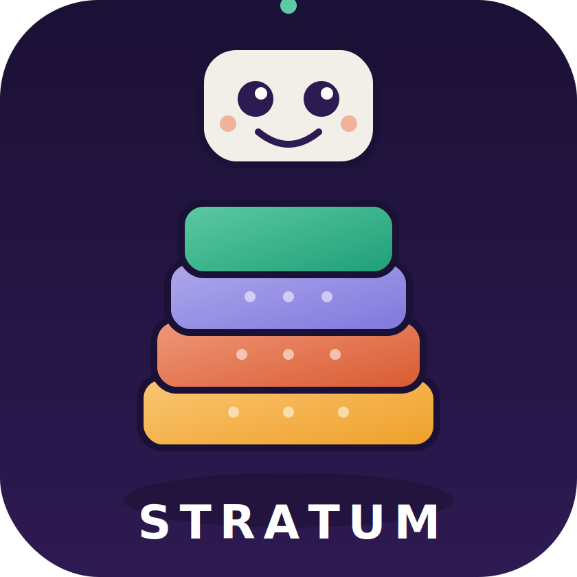
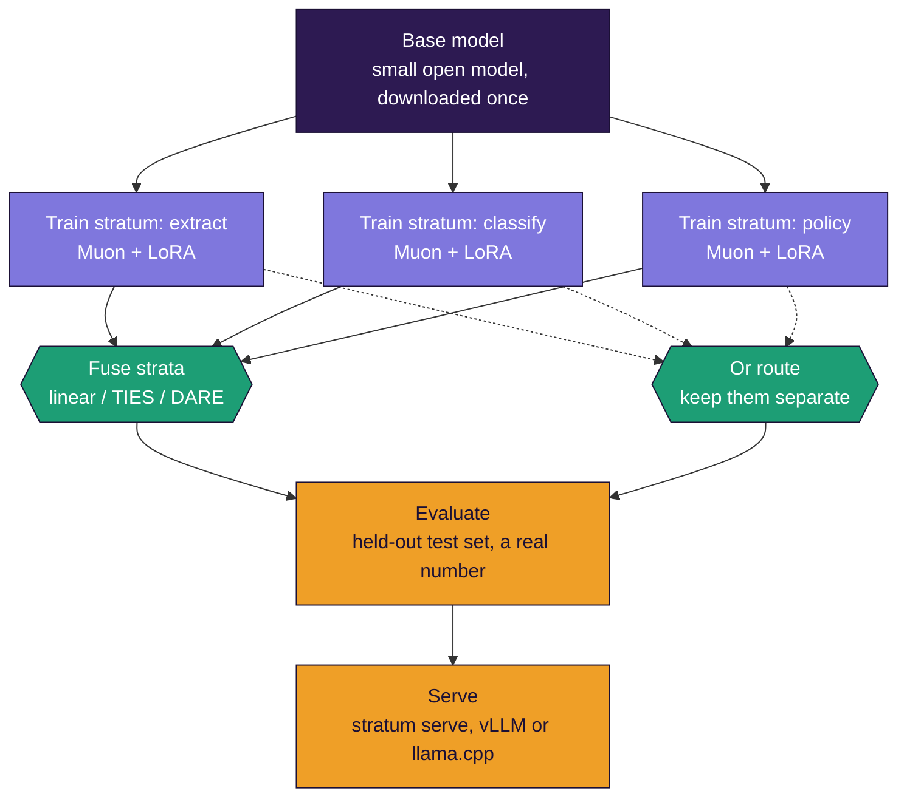

<div align="center">



# STRATUM

### Build industry-specific language models on your laptop - one layer at a time

**S**pecialized **T**raining via **R**eusable **A**dapter **T**iles and **U**nified **M**erging

*Train small skill "strata" independently on commodity hardware, then fuse them into one capable model, leading to industry specific SLM's. No data-center GPUs and No ML PhD needed. Most concepts explained from zero.*

[](LICENSE)
[](pyproject.toml)

</div>

---

## What this is

Most guides to building a custom language model assume a rack of expensive GPUs and a machine-learning background. STRATUM assumes neither. You take a small open model, teach it individual skills **one at a time** on a normal laptop, and **fuse those skills** into one model - like building rock from sediment layers, or a picture from tiles. Each layer (a *stratum*) is cheap to make and can be made in isolation, which is exactly what makes this work on modest hardware. The [documentation](docs/) explains every concept from zero, so you finish not just able to run it, but understanding *why* it works - and able to scale it to production for real industry use.

## Who it's for

- You have a laptop with a consumer GPU (8 GB VRAM is plenty) or a patient CPU.
- You want a model good at *your* specific tasks - extraction, classification, domain Q&A - not a general chatbot.
- You've never trained a model, or you have and want the merge-based approach.
- You want to become an expert, not copy commands blindly.

**Coming from Java, C++, C#/.NET, or backend Python and new to all of this?** Start with [doc 12 - a map from every concept here to patterns you already know](docs/12-for-experienced-developers.md) (adapters as plugins, merging as patch composition, distillation as caching a senior's expertise). It gives you the vocabulary to build *and* explain this to your team and clients.

## The core techniques

STRATUM rests on a few techniques. Understand these and you understand the project. Each is demonstrated with runnable numbers in [`scripts/demo_concepts.py`](scripts/demo_concepts.py) - no GPU needed.

1. **LoRA (adapters)** - freeze the model, train a tiny add-on (under 1% of its size). That add-on fits on a laptop. -> [doc 3](docs/03-lora-and-adapters.md)
2. **Merging** - adapters are *additive*, so skills trained separately combine by (weighted) addition. Build in pieces, fuse at the end. -> [doc 5](docs/05-merging.md)
3. **Muon** - a newer optimizer that keeps half the memory of AdamW and reaches quality in fewer steps, by balancing every training update. -> [doc 4](docs/04-muon-explained.md)
4. **Distillation** - teach your small model to imitate a big "teacher" model, so it captures the teacher's skill at a fraction of the size. Two flavors: the teacher writes your training data, or the student directly matches the teacher's probability distribution. -> [doc 7](docs/07-distillation.md)

## New since the last version

Coming back to this? [Chapter 16](docs/16-what-changed.md) covers all of it properly, assuming nothing and explaining every term. The short version:

| | |
|---|---|
| **`stratum setup`** | Installs whatever your machine is missing. Knows a Mac needs different advice from an NVIDIA box, including that 4-bit will never work there |
| **`stratum route`** | Keeps skills in separate adapters and picks one per request, instead of merging them. Use it when merging starts diluting them |
| **`stratum serve`** | Puts your model behind an OpenAI-compatible address, so your IDE, Claude Code, or any client with a base-URL box can use it |
| **`stratum teachers`** | Tells you which large models this machine can actually run, and how fast |
| **`--concurrency`** | Asks an API teacher several questions at once instead of one at a time |
| **Local teachers auto-compress** | An 8B teacher drops to 4-bit when it would not otherwise fit your card, instead of falling back to the CPU |
| **[`engine/`](engine/README.md)** | Optional C tools. Nothing in the Python side uses them - see [below](#the-engine-folder) |

Two reported bugs are fixed: training could save a diverged epoch over a good one, and adapters failed to attach on some machines only after a multi-gigabyte download had finished. Both now have tests.

## Quick start

```bash
# install
git clone https://github.com/sarkar4777/stratum.git && cd stratum
pip install -e .

# install whatever this machine is missing, and check what it is
stratum setup
stratum doctor

# understand it first (no GPU, ~20s)
python scripts/demo_concepts.py

# have a document corpus instead of ready-made training data? doc 14:
# stratum corpus ingest --in your-docs/ --out corpus/
# stratum corpus pairs --chunks corpus/chunks.jsonl --instruction "..." --out data/skill.jsonl

# train two skill strata (one at a time, on your laptop)
stratum train --skill examples/extract.jsonl --out strata/extract --base Qwen/Qwen3-1.7B
stratum train --skill examples/classify.jsonl --out strata/classify --base Qwen/Qwen3-1.7B

# fuse them into one model
stratum merge strata/extract strata/classify --out models/my-slm

# measure and use (one test set per skill, each with its matching scorer)
stratum eval models/my-slm --test examples/test-extract.jsonl --scorer json_field
stratum eval models/my-slm --test examples/test-classify.jsonl --scorer exact
stratum chat models/my-slm

# or keep the skills apart and route between them instead of merging
stratum route train strata/extract strata/classify --out router.json
stratum serve strata/* --router router.json --port 8927
```

`stratum doctor` is worth running before anything else: as well as your GPU it
checks that the installed PyTorch, transformers and peft actually work
together. They can disagree - transformers 5 needs PyTorch 2.4 or newer, and
some machines (Intel Macs, older CUDA installs) cannot get one. When that
happens transformers silently disables PyTorch and the first training run dies
with `NameError: name 'torch' is not defined`, which points at nothing useful.
Doctor names the mismatch and prints the fix, usually `pip install
"transformers<5"`.

Or run the entire build from one recipe - which also carries its own eval gates, so a finished build is a tested build:

```bash
stratum plan examples/recipe.yaml   # fits this machine? if not - what would, and where to rent it
stratum stack examples/recipe.yaml  # train everything, fuse, run the eval gates
```

If `plan` says the build doesn't fit locally, `stratum plan recipe.yaml --emit-remote remote/` writes a script that runs the identical build and tests on any hourly GPU box and packages the model to bring back. [Doc 10](docs/10-scaling-and-production.md) walks through it.

## What the pipeline looks like



Merging and routing are the two ways to end up with one thing that does several jobs. Merge when the skills complement each other, route when they interfere. [Chapter 15](docs/15-routing-and-serving.md) has the rule for telling which case you are in, and it is measurable rather than a judgement call.

Each stratum is trained on its own, one at a time, so you never hold more than one small tile in memory. They fuse into a single model at the end.

## Documentation - a short book, read in order

| # | Doc | You'll understand |
|---|-----|-------------------|
| 0 | [What is a language model?](docs/00-what-is-a-language-model.md) | Tokens, parameters, training - from zero |
| 1 | [The memory problem](docs/01-the-memory-problem.md) | Why laptops struggle, with real numbers |
| 2 | [The STRATUM idea](docs/02-the-stratum-idea.md) | Why build in independent layers |
| 3 | [LoRA and adapters](docs/03-lora-and-adapters.md) | Training 1% of a model, and rank |
| 4 | [Muon, explained fully](docs/04-muon-explained.md) | Why Muon beats AdamW here |
| 5 | [Merging strata](docs/05-merging.md) | The fuse math, 3 methods, honest limits |
| 6 | [Training internals](docs/06-training.md) | The loss mask and every default |
| 7 | [Distillation](docs/07-distillation.md) | Teaching a small model from a big one |
| 8 | [Evaluation](docs/08-evaluation.md) | Proving it works, not guessing |
| 9 | [Full walkthrough](docs/09-full-walkthrough.md) | Empty folder to working model |
| 10 | [Scaling & production](docs/10-scaling-and-production.md) | Bigger models, serving, industry patterns |
| 11 | [Glossary](docs/11-glossary.md) | Every term, full form, plain definition |
| 12 | [For experienced developers](docs/12-for-experienced-developers.md) | Every concept mapped to patterns you know |
| 13 | [Troubleshooting](docs/13-troubleshooting.md) | The problems people actually hit, with fixes |
| 14 | [From a corpus to a model](docs/14-from-corpus-to-model.md) | Thousands of real documents and images in, tested SLM out - and the RAG boundary |
| 15 | [Routing and serving](docs/15-routing-and-serving.md) | Picking a skill per request instead of merging, and putting it behind an address |
| 16 | [What changed, and why](docs/16-what-changed.md) | Every new command explained from zero, plus what the `engine/` folder is |

**Used an earlier version?** Start at [16](docs/16-what-changed.md) instead. It stands alone.

A complete worked example lives in [`examples/energy/`](examples/energy/): a public web corpus turned into a tested energy-sector SLM, with every command, the measured gains over the base model, and the two failures the build hit on the way.

## Built for industry-specific models

STRATUM suits real domain deployments because a production model usually needs several distinct skills, and modeling each as a stratum gives you:

- **Data residency** - train and serve entirely in the client's environment - nothing leaves.
- **Auditability** - each stratum's `stratum_card.json` records what was trained on what, with what settings.
- **Incremental change** - a rule changes, retrain one stratum and re-fuse. No full retrain.
- **Reuse** - a stratum built for one client drops into the next, given a shared base.
- **Cost** - one small serving GPU forever, plus a few tens of dollars of training burst per build.

[Doc 10](docs/10-scaling-and-production.md) covers the full production loop.

## The engine folder

There is C code in [`engine/`](engine/README.md). **Nothing in STRATUM calls it, you never need to compile it, and skipping this section costs you nothing.** It is explained here because unexplained C in a Python project is worse than no C at all.

**What it is.** Two finished, tested command line tools and the code they share.

```bash
cd engine && make          # any C99 compiler, no dependencies
```

| Tool | What it does |
|---|---|
| `stratum-gguf FILE` | Prints what is inside a GGUF model file - its architecture, layer count, how it was quantized, and every tensor if you ask. Reads only the directory, so it answers instantly on a file of any size |
| `stratum-bandwidth FILE` | Reads the same blocks from a file in three different orders and reports the speed of each. Reads bypass the operating system cache, so it measures your drive rather than your memory |

**Where it plugs in.** Nowhere, and that is deliberate rather than unfinished. Both are standalone diagnostics you run yourself. `stratum-gguf` tells you what a model you downloaded actually is. `stratum-bandwidth` answers a question about your hardware.

**Why it exists at all.** It was the beginning of an inference engine for running enormous sparse models as teachers, inspired by [kimi-k3-in-c](https://github.com/FareedKhan-dev/kimi-k3-in-c). The design was reviewed before being built and two findings stopped it: the core scheduling idea turned out to be [published prior art](engine/README.md#credit-where-it-is-due), and measurement showed the disk was never the bottleneck in the first place - the arithmetic is roughly twelve times slower than the reading.

The measuring tool is what produced that second finding, which is why it is the part that shipped. [engine/README.md](engine/README.md) has the full account, including the numbers that killed the idea.

If you want to run a large model locally today, use [llama.cpp](https://github.com/ggml-org/llama.cpp) or [Ollama](https://ollama.com), and run `stratum teachers` to see which ones fit. STRATUM talks to either through `--teacher llama-cpp`.

## What STRATUM is *not*

- **Not a general-knowledge model.** It's excellent at the specific skills you train in, not at being a universal genius. That's the point.
- **Not instant.** On a laptop, one stratum is minutes to a couple of hours. A "start it before lunch" workflow.
- **Not magic merging.** Strata from different bases, or deeply conflicting skills, won't fuse cleanly - [doc 5](docs/05-merging.md) is honest about the limits.
- **Not a substitute for good data.** The biggest quality lever is the quality of your skill examples.

## Verify it yourself

```bash
python scripts/demo_concepts.py # the core ideas, real numbers, no GPU
python -m pytest tests/ -v # unit tests plus a full pipeline run on a tiny model
stratum doctor # checks your GPU and Hugging Face readiness
```

Every code path in this repo - the optimizer math, delta extraction, all three
merge methods, the loss mask, the scorers, and the distillation loss - is covered
by the test suite. The pipeline test builds a tiny model from scratch, trains two
strata on it, merges them with every method, checks the merged weights are exactly
base plus deltas, and evaluates the result - on CPU, in seconds. The same suite
runs in CI on every push.

## Acknowledgements

STRATUM assembles published research and open tooling into one teachable pipeline.
The credit for the underlying methods belongs to their authors:

- **LoRA** - Hu et al., "LoRA: Low-Rank Adaptation of Large Language Models" (2021)
- **QLoRA** - Dettmers et al., "QLoRA: Efficient Finetuning of Quantized LLMs" (2023)
- **Muon** - Keller Jordan (2024), building on Jeremy Bernstein's work on orthogonalized updates
- **TIES merging** - Yadav et al., "TIES-Merging: Resolving Interference When Merging Models" (2023)
- **DARE** - Yu et al., "Language Models are Super Mario: Absorbing Abilities from Homologous Models" (2023)
- **Distillation** - Hinton, Vinyals and Dean, "Distilling the Knowledge in a Neural Network" (2015)
- **Tooling** - Hugging Face Transformers and PEFT, the bitsandbytes library, PyTorch, and the Qwen team's open models
- **GGUF and the block quantization formats** - Georgi Gerganov and the [ggml and llama.cpp](https://github.com/ggml-org/llama.cpp) contributors. The optional C engine reads their format, and `stratum teachers` recommends running big models with their runtime.
- **The idea behind the C engine** - [kimi-k3-in-c](https://github.com/FareedKhan-dev/kimi-k3-in-c) by Fareed Khan, which runs a 2.78-trillion-parameter model on one CPU in 8.24 GB. Its published measurement of why an expert cache stops helping is what pointed at a different schedule. [engine/README.md](engine/README.md) explains the debt in full.

Thanks also to the people who ran this on hardware the author does not have and reported what broke. The adapter dispatch failure on Apple silicon and the Muon learning rate problem on small models were both found that way, on an Intel Mac and a Colab T4, and both are fixed in the current version. Bug reports from a machine nobody on the project owns are worth more than they look.

## License

MIT - use it commercially, modify it, ship it. Contributions welcome - see [CONTRIBUTING.md](CONTRIBUTING.md).

<div align="center">

*Small layers. One model.*

</div>
