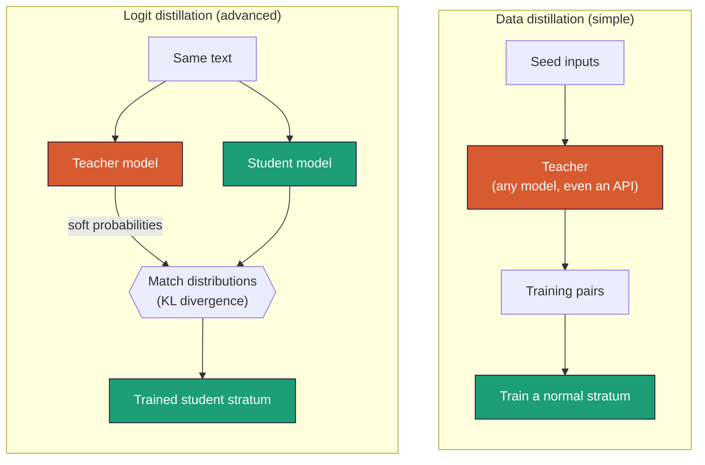

# 7 - Distillation: teaching a small model from a big one

*One of the most powerful ways to build a good small model. Explained from zero for a developer who has never touched machine learning, then shown as real STRATUM commands and code.*

---

## The idea, by analogy

Imagine a master craftsperson (the **teacher**) and an apprentice (the **student**). The apprentice could learn purely from a rulebook (fixed correct answers). But they learn far faster by watching the master work - seeing not just *what* the master does, but *how confident* the master is, which alternatives they considered, where they hesitated.

**Distillation** is exactly this for models. You have a big, capable **teacher** model and a small **student** model. Instead of training the student only on fixed human-written answers, you train it to imitate the teacher. The student ends up much better than it would from the rulebook alone - often nearly as good as the teacher on the specific skill, at a fraction of the size and cost.

This is one of the main ways strong small models are actually built in industry. If you've heard "this 3B model punches above its weight," distillation from a bigger model is often why.

## Why it works: the teacher's "soft" knowledge

Here's the insight that makes distillation more than just "copy the teacher's answers."

When a model predicts the next token (doc 0), it doesn't just pick one - it produces a *probability for every possible token*. Ask a model to classify a ticket and it might output:

```
billing 77%
account_access 17%
bug 4%
how_to 2%
```

The single correct answer is "billing." A rulebook teaches only that. But the *full distribution* carries much richer information: it says billing is likely, account_access is a plausible near-miss, and bug/how_to are basically wrong. That shape - the teacher's **uncertainty** - is knowledge. It tells the student *how* to think about the problem, not just the final answer.

Training the student to match the teacher's whole distribution (called the **soft labels**) instead of just the one correct token (the **hard label**) is what gives distillation its power. The student learns the teacher's judgment, not just its conclusions.

## Watch temperature work

One knob is left to explain: **temperature**. Why do we need it at all? Because a confident teacher hides its own judgment: the near-miss answers sit at probabilities so small that when the student is trained to match the distribution, they contribute almost nothing - the student ends up learning little more than the hard label. Temperature fixes that: divide the teacher's raw scores (the logits) by a number T greater than 1 before turning them into probabilities, and the distribution flattens - the near-misses become large enough to teach from. The demo shows what that does to the ticket example above (`python scripts/demo_concepts.py`, demo 6):

```
                      T=1      T=2      T=4
         billing   76.7%   53.5%   38.8%
  account_access   17.1%   25.3%   26.7%
             bug    3.8%   11.9%   18.3%
          how_to    2.3%    9.3%   16.2%
```

Same teacher, same scores. At T=1 the runner-up is barely visible - the student would learn little more than the hard label. At T=2 the near-miss is a quarter of the distribution: the student can now *see* that account_access was plausible, which is the judgment we wanted to transfer. Push too far (T=4) and everything blurs toward uniform, teaching the student that even the nonsense options were half-reasonable. The default of 2.0 sits between those two failure modes.

## Two ways to distill (STRATUM supports both)

There are two flavors, and picking the right one matters. STRATUM gives you both.



Data distillation (top) has the teacher write your training data, then trains a normal stratum - the teacher can be anything, including a closed API. Logit distillation (bottom) runs teacher and student together and trains the student to match the teacher's full probability distribution - richer, but they must share a tokenizer.

### Flavor 1 - Data distillation (simple, recommended to start)

The teacher **writes your training data**. You give it a pile of example inputs (documents, tickets, questions), the teacher produces an ideal answer for each, and those input->answer pairs become a normal training set you feed to `stratum train`.

- **Pro:** dead simple, robust, and the teacher can be *anything* - including a closed API like GPT or Claude that you can't run locally. You never need teacher and student to be compatible.
- **Con:** the student learns only the teacher's final answers (the hard labels), not its full uncertainty. Still very effective - this gets you most of the benefit.

This is the right default for almost everyone.

### Flavor 2 - Logit distillation (advanced, maximum quality)

Teacher and student run on the same text *at the same time*, and the student is trained to match the teacher's full probability distribution (the soft labels) directly. The name: a **logit** is the raw score a model assigns to each vocabulary token before those scores become probabilities - this flavor matches the teacher at that raw-score level.

- **Pro:** the richest possible signal - the student learns the teacher's uncertainty. Best final quality.
- **Con:** teacher and student must **share a tokenizer** (be from the same model family, e.g. both Qwen3), and *both* must fit in memory together. More setup, more hardware.

Use this when you have a capable local teacher from the same family as your student and want to squeeze out the last bit of quality.

## Data distillation - the commands

Say you want an invoice-extraction skill and you have a big teacher to generate clean examples.

**Step 1 - collect seed inputs.** A text file, one raw input per line (`seeds.txt`):

```
Subtotal $80, Tax $8, Total $88
Amount due: $250.00
Grand total: 1,499 EUR
```

**Step 2 - have the teacher write the training pairs:**

```bash
# Using a local Hugging Face teacher model:
stratum teacher-gen \
  --seeds seeds.txt \
  --instruction "Extract the invoice total as JSON like {\"total\": N}." \
  --teacher hf --model Qwen/Qwen3-4B \
  --out examples/extract_distilled.jsonl

# Or using an API teacher (set the key first):
export OPENAI_API_KEY=sk-...
stratum teacher-gen --seeds seeds.txt \
  --instruction "Extract the invoice total as JSON." \
  --teacher openai --model gpt-4o-mini \
  --out examples/extract_distilled.jsonl
```

Provider model names age quickly - check your provider's current model list and pass `--model` explicitly rather than trusting an example or a built-in default to stay current.

STRATUM asks the teacher for each seed and writes a `{"prompt","response"}` JSONL. Seven teacher backends ship: `hf` (a local model - nothing leaves your machine), `llama-cpp` (any local server on the OpenAI dialect, which is how you point at a big quantized model - doc 15), `claude-cli` (Claude through the installed Claude Code CLI, billed to your existing subscription with no API key), `openai`, `anthropic`, and `gemini` (the respective APIs, each needing its key), and `echo` (a no-op for testing the pipeline).

Three details matter when you scale this to thousands of seeds:

- **Each pair is written the moment it exists.** A crash or network drop at seed 4,999 of 5,000 loses one pair, not the run.
- **Failed calls retry with growing pauses**, and re-running the same command **resumes** - seeds already answered in the output file are skipped. Generating a big dataset against a flaky API is a matter of re-running until it's done.
- **The teacher's answers arrive clean.** If the teacher is a thinking model (doc 6), its `<think>` reasoning is stripped so your training data contains answers, not deliberation.

### How big a local teacher can you actually run

A teacher is only ever read, never trained, so it needs room for its weights and very little else. In full precision that is roughly 2 GB per billion parameters, which puts an 8B teacher at about 17 GB and out of reach of most laptop GPUs.

Quantizing fixes that, and `--teacher hf` does it for you. Before loading, STRATUM compares the model's size against your actual VRAM and switches to 4-bit when full precision would not fit, printing a line when it does:

```
Loading Hugging Face teacher: Qwen/Qwen3-8B
 loading in 4-bit so it fits the GPU
```

That takes the same 8B teacher to about 5.5 GB, so it runs on an 8 GB card at full GPU speed instead of falling back to the CPU and taking roughly twenty times longer. Quality loss on a read-only model is small, and the alternative is not a better teacher but a much slower one.

Nothing is quantized when it already fits, and nothing is quantized on a machine without an NVIDIA GPU, where `bitsandbytes` does not apply. Run `stratum teachers` first if you want the sizing worked out before you commit to a download.

**Step 3 - train a normal stratum on the distilled data:**

```bash
stratum train --skill examples/extract_distilled.jsonl --out strata/extract
```

That's it. The teacher's expertise is now baked into a small, mergeable stratum. It fuses with your other strata like any other (doc 5).

## Logit distillation - the command

When you have a same-family teacher and want maximum quality:

```bash
stratum distill \
  --skill examples/extract.jsonl \
  --out strata/extract \
  --student Qwen/Qwen3-1.7B \
  --teacher Qwen/Qwen3-4B \
  --temperature 2.0 \
  --alpha 0.5
```

- `--student` learns, `--teacher` is imitated (frozen).
- `--temperature 2.0` **softens** both distributions so the student learns from the teacher's smaller, informative probabilities, not just its top pick. Higher temperature = softer = more attention to the teacher's "second thoughts." 2.0 is a good default.
- `--alpha 0.5` balances the two losses: half from matching the teacher's soft distribution, half from the true answer. 0.5 is a sane default, raise it to trust the teacher more.
- `--teacher-4bit` compresses the frozen teacher to 4 bits on an NVIDIA GPU. The teacher is only read, never trained, so this is nearly free (doc 1's quantization lever again) and it roughly quarters the teacher's memory - often the difference between "doesn't fit" and "fits".
- `--grad-accum 4` gives logit distillation the same effective-batch trick as normal training (doc 6), since its per-step batches must be small enough for two models at once.

STRATUM checks that teacher and student share a vocabulary and gives a clear error if they don't - a common beginner trap.

## What the code actually does

The heart of logit distillation is the loss function (`stratum/distill.py`). In plain terms it computes two things and blends them:

```python
# Soft loss: student should match the teacher's SOFTENED distribution.
# KL divergence measures how different two probability distributions are.
soft = KL( softmax(teacher / T) , softmax(student / T) ) * T*T

# Hard loss: ordinary next-token loss against the real answer.
hard = cross_entropy(student, true_tokens)

loss = alpha * soft + (1 - alpha) * hard
```

- **KL divergence** is just "how far apart are these two probability distributions." Minimizing it pulls the student's distribution toward the teacher's.
- The `T*T` term restores the gradient strength that temperature-softening would otherwise shrink - a standard detail, handled for you.
- Loss is computed only on the response tokens (the loss mask from doc 6 applies here too).

You don't need to memorize this - but now you can read it and explain it. That's the KL-divergence-and-temperature machinery from the original distillation paper - Hinton, Vinyals and Dean, "Distilling the Knowledge in a Neural Network" (2015) - and it's twelve lines.

## How much data does a distilled skill need

The commonest question, and the commonest reason a distilled stratum
disappoints. These are working numbers, not theory - they come from building
skills with this tool.

| Pairs | What you get |
|---|---|
| under 50 | Proves the pipeline runs. Eval numbers on this much data are noise, and a stratum can collapse outright (doc 6's data check warns about it). |
| 100-300 | A format or style skill starts to hold - answering as JSON, using your terminology, keeping a house tone. Knowledge-shaped skills are still shaky. |
| 500-1,500 | The usual sweet spot for one well-scoped skill. Extraction and classification are reliable here, and eval scores start moving predictably when you change something. |
| 2,000-5,000 | Production quality for most skills, and where distillation earns its cost - enough coverage that the student generalizes rather than memorizes. |
| 10,000+ | Hard skills, wide input variety, or when you need the model to hold up on inputs nobody anticipated. |

Multiply by the number of skills - a three-skill model at 1,000 pairs each is
3,000 teacher calls, which is a real budget line against an API teacher and a
few hours against a local one.

Quality beats quantity, and the gap is not close. Two thousand consistent
pairs beat twenty thousand sloppy ones, because every inconsistency teaches
the student that the format is optional. Concretely, from this project's own
reference build (`examples/energy/`): the same skill, same count of pairs,
same settings, scored **5.3%** taught by a small local model and **56.4%**
taught by a strong one. Nothing changed but the teacher.

Three checks worth doing before you spend the compute:

- **Read twenty pairs yourself.** If you would not accept the answer from a
  colleague, the student is learning to produce it. This catches more problems
  than any metric.
- **Watch the response lengths.** Bare values ("32%") make a stratum that
  learns to stop immediately - answer in short sentences instead ("The share
  is 32%"). Training prints these statistics before it starts.
- **Hold out 10-20% before training** (`--test-fraction` does it per chunk),
  and be suspicious of a skill that scores well on data its teacher also
  wrote. The teacher's blind spots are in both halves.

## When to use distillation

- **You have access to a much better model** (an API or a big local one) and want a small deployable model that captures its skill. -> distillation, ideally data distillation first.
- **Your hand-written data is thin.** A teacher can generate thousands of consistent examples cheaply. -> data distillation.
- **You need the absolute best small-model quality and have a same-family teacher.** -> logit distillation.
- **You already have plenty of good real data and no better teacher.** -> skip distillation - plain `stratum train` is fine.

## Two teachers on the same documents

This is worth showing because the result is not the one you would guess.

The same 1,097 chunks of energy engineering documents were given to two teachers, with identical instructions, and three skills were built from each. Every stratum is `Qwen3-1.7B`, rank 16, three epochs. Each was scored against its own teacher's held-out questions with the word overlap scorer.

| Skill | Claude as teacher | Qwen3-8B as teacher |
|---|---|---|
| explain | 27.8% | **33.1%** |
| extract | **48.1%** | 3.6% |
| safety | 24.5% | **29.8%** |

The local 8B model wins two of the three, which is not what most people expect from a small local teacher against a large hosted one.

The third row is where the lesson is, and it is not that Qwen cannot extract. Look at how long each teacher's answers are:

| Skill | Claude, median answer | Qwen3-8B, median answer |
|---|---|---|
| explain | 57 words | 25 words |
| extract | 14 words | **2 words** |
| safety | 46 words | 24 words |

Asked for a specific value, Qwen answered with the value and nothing else. `60% to 75%`. `Weeks`. Claude wrote a sentence around it.

Word overlap scoring is merciless on a two word answer. Reply `Between 70 and 90 percent` when the expected answer is `60% to 75%` and you score zero, with no partial credit for having understood the question. On a fourteen word answer the same near miss still scores something.

So part of that 3.6% is the scorer, and part of it is real, and separating the two is the actual work. The model genuinely got some values wrong. It was also punished far harder for it than the other model was.

**Two things follow.** Your scorer has to match the shape of the answers your teacher writes, and doc 8 covers picking one. And when you compare teachers, compare the answer lengths first, because a teacher that writes tersely will look worse than it is under any overlap based score.

## The honest caveats

- **The student can't exceed the teacher** on the distilled skill - it's imitating. If the teacher is wrong, the student learns the mistake. Use a teacher genuinely better than your student.
- **A remote teacher sees your seed inputs.** Every seed you feed `teacher-gen` with `--teacher claude-cli`, `openai`, `anthropic`, or `gemini` is sent to that provider. If the seeds are client documents, tickets, or anything under a data-residency requirement, that transfer may itself be a compliance violation - use a **local** teacher (`--teacher hf`) so nothing leaves your environment, which is the whole promise of doc 10's production loop.
- **Data distillation inherits the teacher's licensing.** If you distill from a commercial API, check that its terms permit training a model on its outputs. This is a real legal consideration for industry work, not just a formality.
- **Logit distillation needs a shared tokenizer.** Qwen-teacher to Llama-student won't work for logit distillation (their vocabularies differ) - use data distillation across families instead.

## What you now know

- **Distillation** teaches a small **student** to imitate a big **teacher**, learning the teacher's judgment, not just its answers.
- The teacher's **soft labels** (full probability distribution) carry richer knowledge than a single correct answer.
- **Data distillation** (teacher writes the data) is simple and works across any models - start here.
- **Logit distillation** (student matches the teacher's distribution via KL divergence, softened by temperature) gives top quality but needs a same-family teacher.
- Both produce ordinary strata that **fuse like any other**.

Next: [evaluation - proving your model works instead of guessing ->](08-evaluation.md)
